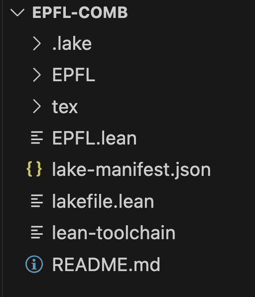

# EPFL Lean mini course

This material is adapted from the [Mathematics in Lean book](https://leanprover-community.github.io/mathematics_in_lean/index.html),
and from the [Lean for the Curious Mathematician 2023 workshop](https://lftcm2023.github.io/).

This material depends on Lean 4, VS Code, and Mathlib.
Alternatively, you can use Github Codespaces or Gitpod to run Lean and VS Code in the cloud.

## To use this repository on your computer

Do the following:

1. Install Lean 4 and VS Code following
   these [instructions](https://leanprover-community.github.io/get_started.html).

2. Make sure you have [git](https://git-scm.com/) installed.

3. Follow these [instructions](https://leanprover-community.github.io/install/project.html#working-on-an-existing-project)
   to fetch [this repository](https://github.com/b-mehta/epfl-comb) and open it up in VS Code. Note
   that the instructions there use the Mathematics in Lean book as an example, which is *not* what
   you should do. Instead, in place of Step 3, run
   `git clone https://github.com/b-mehta/epfl-comb.git`, then in place of Step 4, run
   `cd epfl-comb`.
   The remaining steps can be followed as written, but be sure to choose the folder `epfl-comb`
   when you `Open folder` in VSCode. You can check you are in the correct folder if `lakefile.lean` if the Explorer tab on the left looks like this.
   

4. Each section in the textbook has an associated Lean file with examples and exercises.
   You can find them in the folder `EPFL`, organized by chapter.

## To use this repository with Github Codespaces

If you have trouble installing Lean, you can use Lean directly in your browser using Github
Codespaces.
This requires a Github account. If you are signed in to Github, click here:

Make sure the Machine type is `4-core`, and then press `Create codespace`
(this might take a few minutes).
This creates a virtual machine in the cloud,
and installs Lean and Mathlib.

Opening any `.lean` file in the MIL folder will start Lean,
though this may also take a little while.
You can update the repository by opening a terminal in the browser
and typing `git pull` followed by `lake exe cache get` as above.

Codespaces offers a certain number of free hours per month. When you are done working,
press `Ctrl/Cmd+Shift+P` on your keyboard, start typing `stop current codespace`, and then
select `Codespaces: Stop Current Codespace` from the list of options.
If you forget, don't worry: the virtual machine will stop itself after a certain
amount of time of inactivity.

To restart a previous workspace, visit <https://github.com/codespaces>.

## To use this repository with Gitpod

Gitpod is an alternative to Github Codespaces, but is a little less convenient,
since it requires you to verify your phone number.
If you have a Gitpod account or are willing to sign up for one,
point your browser to
[https://gitpod.io/#/https://github.com/b-mehta/epfl-comb](https://gitpod.io/#/https://github.com/b-mehta/epfl-comb)
This creates a virtual machine in the cloud, and installs Lean and Mathlib.  It then presents you
with a VS Code window, running in a virtual copy of the repository.
You can update the repository by opening a terminal in the browser
and typing `git pull` followed by `lake exe cache get` as above.

Gitpod gives you 50 free hours every month.
When you are done working, choose `Stop workspace` from the menu on the left.
The workspace should also stop automatically
30 minutes after the last interaction or 3 minutes after closing the tab.

To restart a previous workspace, go to [https://gitpod.io/workspaces/](https://gitpod.io/workspaces/).
If you change the filter from Active to All, you will see all your recent workspaces.
You can pin a workspace to keep it on the list of active ones.
